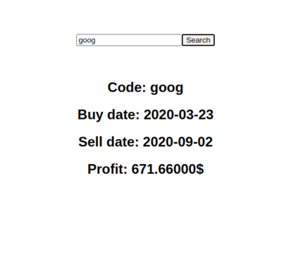

# 1. Overview

## Architecture

  

## Environment

OS: Ubuntu 18.04  
Python: 3.6.9  
Django: 3.1.1  
Django Rest Framework: 3.11.1  
Other libraries: requirements.txt  
Node: 8.10.0  
Npm: 3.5.2  
Modules: frontend/node_modules, backend/node_modules
  

# 2. Algorithm

## 문제 상황

'180일 간의 주식 가격이 주어졌을 때 최대 이익을 가질 수 있는 매수 및 매도 날짜'

## 가정

api로 받아 올 수 있는 데이터는 상한가, 하한가, 종가였습니다.  
주어진 데이터로는 특정 날짜에 대한 연속적인 가격 흐름을 알기 어렵다고 판단하여  
주식 가격은 '종가'로 계산하였습니다.

주어진 데이터의 날짜 범위는 api에서 제공하는 최신 날짜로부터 180일로 한정하였습니다.  
만일, api에서 제공하는 최신 데이터가 180개가 되지 않는다면, 지원하는 날짜까지만 계산하였습니다.

## Naive Solution: O(N^2)

N개의 데이터에 대해 모든 매수 날짜, 매도 날짜 쌍을 검사합니다. (매수 날짜 < 매도 날짜)

## Optimal Solution: O(N)

N개의 데이터 중 최저점과 최고점을 찾는 것으로 문제를 단순화 할 수 있습니다. (이때 최고점은 반드시 최저점 뒤에 나와야 합니다.)  
N개의 데이터를 한 번만 순회하며

1. 기존 최저점 보다 높은 값이 등장할 때:  
   기존 최고점과 비교하여 더 큰 이익을 낼 수 있다면 갱신합니다.

2. 기존 최저점 보다 낮은 값이 등장할 때:  
   최저점을 갱신합니다.

이렇게 탐색한다면 O(N) 시간복잡도로 해결 할 수 있습니다.
  

# 3. Design

## First Approach

빠르게 개발 할 수 있는 python django framework를 처음 떠올렸습니다.  
MVT 디자인 패턴을 사용하여 사용자에게 보여지는 부분, 내부 로직, ORM을 통한 데이터 관리를 손쉽게 할 수 있기 때문입니다.

stock data api는 무료로 사용할 수 있는 'yahoo finance API'를 사용하기로 계획하였습니다.

다만 front end 구성 시 django template, form을 이용하면 다수의 페이지를 렌더링하기에 비효율적이라고 판단하였고, 이를 SPA로 변경하였습니다.
  

## Second Approach

ReactJS를 사용하여 front end 구성을 SPA로 변경하였습니다.  
또한 front end와 분리하기 위해 기존 django wep app을 django restframework를 사용하여 api 서버로 변경하였습니다.

배포 환경을 고려하여 ExpressJs를 프록시 웹서버로 지정하였고, api 서버 또한 uWSGI를 거쳐 요청 및 응답을 하도록 변경하였습니다.
  

## Final Approach

### < Front end >

ReactJs (localhost port 3000)  
ExpressJs for proxy web server (localhost port 3001)

### < Back end >

django rest framework
uWSGI (localhost port 8000)

### < Third party API >

Yahoo finance API -> Could be easily interchangeable

### < Data Managing & DBMS >

Django ORM  
SQLite  
일종의 캐시 역할을 합니다.  
DBMS에 요청한 데이터가 없을 경우 Third party API를 통해 데이터를 받아 온 후 DBMS에 저장합니다.  
각 stock code 당 최대 최신의 180개 데이터만 저장합니다.
  

## 개선 사항

현재 SQLite로 로컬에서 DBMS를 운영하고 있습니다. 성능을 고려한다면, 향후 배포 시 MySQL이나 MongoDB 등으로 바꾸어 로컬이 아닌 다른 서버에 배포하여야 합니다.

현재 데이터가 저장되는 테이블을 분리하지 않고 개발 편의상 하나의 테이블을 사용하고 있습니다.  
실제 서비스에서는 굉장한 병목 현상이 일어날 것으로 예상됩니다.  
향후 배포 시 stock code마다 테이블을 생성하는 방식으로 분리하는 것이 필요합니다.
  

# 4. Testing

## 실행 환경

간편하게 실행 할 수 있도록 run.sh 파일을 만들었습니다.

### \$ sh run.sh

위 명령어롤 통해 실행하면 됩니다.
  

## 실행 결과

### 초기 화면

  

### 올바른 코드 입력 시

  

### 잘못 된 코드 입력 시

  

## API Test

**380**개의 stock code를 csv file로 저장하여 이 code들에 대한 api test를 진행하였습니다.  
**Test file(test.py)**을 통해 api test를 간편하게 실행할 수 있습니다.
  

# 5. Trouble Shooting

## CORS

ReactJS, ExpressJs와 api server간 리소스 요청 시 보안 상의 이유로 CORS문제가 발생합니다.  
CORS whitelist에 각각의 host, port를 명시하여 이를 해결하였습니다.
  

## Nan value

stock data 중 price에서 nan값을 가지는 경우가 있었습니다.  
이를 검사하여 만일 nan값일 경우, 최근 날짜의 price값으로 대체하는 로직을 추가하였습니다.
